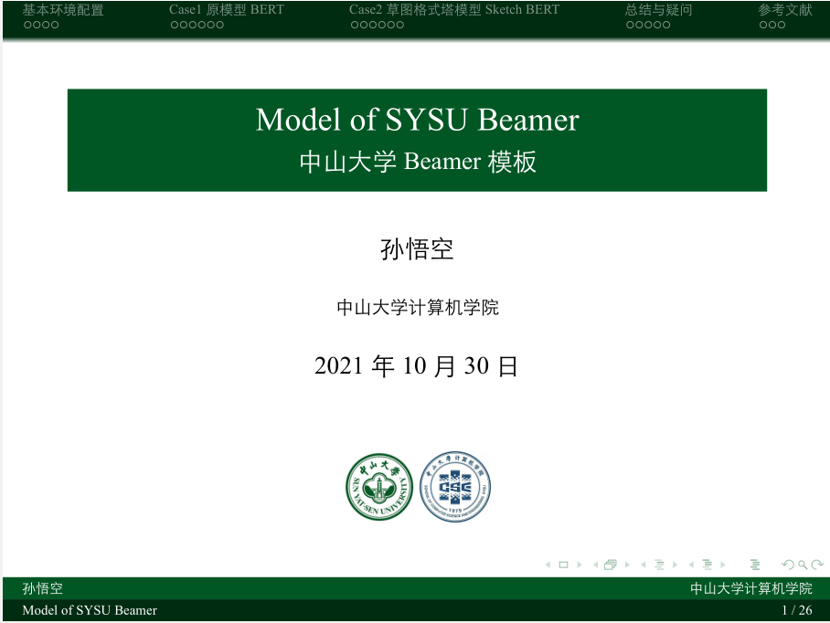

# SYSU-Beamer

中山大学Beamer设计，主色调采用了中大校徽的绿色，简洁明快，易于上手，适合有一定LaTeX基础的朋友。

具体设计思路参照了Overleaf网站上的[THU Beamer Theme](https://www.overleaf.com/latex/templates/thu-beamer-theme/vwnqmzndvwyb)。

pdf的实际呈现效果如下：

